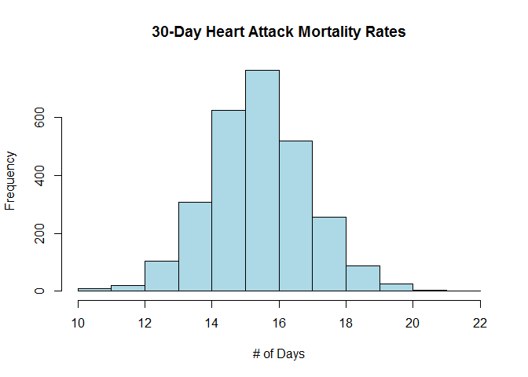

# Mortality Rates in Hospitals
Jeferson Bisconde  
Sunday, May 18, 2014  
**--------------------------------------------------------------------------------------------------------------------------------------------**

### Hospital's 30-Day Mortality Rates

The data for this assignment come from the [Hospital Compare web site](http://hospitalcompare.hhs.gov) run by the U.S. Department of Health and Human Services. The purpose of the web site is to provide data and information about the quality of care at over 4,000 Medicare-certified hospitals in the U.S.

This dataset essentially covers all major U.S. hospitals.

I will focus on the variables for Number 19, **Outcome of Care Measures**, and Number 11, **Hospital Data**.

**----------------------------------------------------------------------------------------------------------------------------------------------**

**Plot of 30-day Mortality Rates for Heart Attack**

```r
outcome <- read.csv("outcome-of-care-measures.csv", colClasses="character")
```


```r
outcome[, 11] <- as.numeric(outcome[, 11])
```

```
## Warning: NAs introduced by coercion
```

```r
# You may get a warning about NAs being introduced; that is okay.
hist(outcome[, 11], 
     main="30-Day Heart Attack Mortality Rates", xlab="# of Days", col="light blue")
```

 
**---------------------------------------------------------------------------------------------------------------------------------------------**

**Finding the best Hospital in a State**

* Hospital that has the best (i.e. lowest) 30-day Mortality for the specified outcome in that State.
* Specifically, **Heart Attack**, **Heart Failure**, and **Pneumonia**:
        
**Handling ties.** If there is a tie for the best Hospital for a given outcome, then the hospital names should be sorted in `alphabetical order` and the `first Hospital` in that set should be chosen.

```r
best <- function(dataset, state, outcome){
        # 11 - Heart Attack, 17 - Heart Failure, 23 - Pneumonia
        checkOutcome <- data.frame(c("heart attack", "heart failure", "pneumonia"), c(11, 17, 23))
        matchOutcome <- checkOutcome[checkOutcome==outcome, 2]
        
        # Check that state and outcome are valid
        if (!(state %in% dataset$State)){
                stop("The state is invalid!")
        }
        if (length(matchOutcome)==0){
                stop("The outcome is invalid!")
        }
        # Return the hospital name in that state with lowest 30-day death rate
        dataset <- dataset[dataset[matchOutcome]!="Not Available", ]
        dataset <- dataset[!is.na(dataset[matchOutcome]), ]
        dataset[, matchOutcome] <- as.numeric(dataset[, matchOutcome])
        
        hospital <- dataset[dataset$State==state, c(2, matchOutcome)]
        hospital <- hospital[order(hospital[, 2], hospital[, 1]), ]

        return(hospital)
}
```

Here is some sample output from the function.

```r
best(outcome, "TX", "heart attack")[1, 1]
```

```
## [1] "CYPRESS FAIRBANKS MEDICAL CENTER"
```

```r
best(outcome, "TX", "heart failure")[1, 1]
```

```
## [1] "FORT DUNCAN MEDICAL CENTER"
```

```r
best(outcome, "MD", "heart attack")[1, 1]
```

```
## [1] "JOHNS HOPKINS HOSPITAL, THE"
```

```r
best(outcome, "MD", "pneumonia")[1, 1]
```

```
## [1] "GREATER BALTIMORE MEDICAL CENTER"
```
**---------------------------------------------------------------------------------------------------------------------------------------------**

**Hospital Rankings by Outcome in a State**

The num variable can take values **best**, **worst**, or an **integer** indicating the ranking (smaller numbers are better).

If the number given by `num` is larger than the number of Hospitals in that state, then the function should return **NA**.

```r
rankHospital <- function(dataset, state, outcome, num="best"){
        hospital <- best(dataset, state, outcome)
        if(num=="best"){
                num=1
        }
        else if(num=="worst"){
                num=nrow(hospital)
        }
        return(hospital[num, 1])
}
```

Here is some sample output from the function.

```r
rankHospital(outcome, "TX", "heart failure", 4)
```

```
## [1] "DETAR HOSPITAL NAVARRO"
```

```r
rankHospital(outcome, "MD", "heart attack", "worst")
```

```
## [1] "HARFORD MEMORIAL HOSPITAL"
```

```r
rankHospital(outcome, "MN", "heart attack", 5000)
```

```
## [1] NA
```
**---------------------------------------------------------------------------------------------------------------------------------------------**

**Hospital Rankings in all States**

This function returns a 2-column data frame containing the Hospital in each `State` that has the ranking specified in `num`. 

For example, the function call `rankall(outcome, "heart attack", "best")` would return a data frame containing the names of the hospitals that are the best in their respective States for 30-day Heart Attack death rates. 

The function should return a value for **every State** (some may be NA). 

Hospitals that do not have data on a particular outcome will be excluded from the set of hospitals when deciding the rankings.

**Handling ties.** The rankall function handles ties the same way as rankHospital function.

```r
rankall <- function(dataset, outcome, num="best"){
        state <- unique(dataset$State)
        state <- state[order(state)]
        hospitalRank <- data.frame(hospital=sapply(state, rankHospital, dataset=dataset, outcome=outcome, num=num), state=state)
        
        return(hospitalRank)
}
```

Here is some sample output from the function.

```r
head(rankall(outcome, "heart attack", 20), 10)
```

```
##                               hospital state
## AK                                <NA>    AK
## AL      D W MCMILLAN MEMORIAL HOSPITAL    AL
## AR   ARKANSAS METHODIST MEDICAL CENTER    AR
## AZ JOHN C LINCOLN DEER VALLEY HOSPITAL    AZ
## CA               SHERMAN OAKS HOSPITAL    CA
## CO            SKY RIDGE MEDICAL CENTER    CO
## CT             MIDSTATE MEDICAL CENTER    CT
## DC                                <NA>    DC
## DE                                <NA>    DE
## FL      SOUTH FLORIDA BAPTIST HOSPITAL    FL
```

```r
tail(rankall(outcome, "pneumonia", "worst"), 3)
```

```
##                                      hospital state
## WI MAYO CLINIC HEALTH SYSTEM - NORTHLAND, INC    WI
## WV                     PLATEAU MEDICAL CENTER    WV
## WY           NORTH BIG HORN HOSPITAL DISTRICT    WY
```

```r
tail(rankall(outcome, "heart failure"), 10)
```

```
##                                                             hospital state
## TN                         WELLMONT HAWKINS COUNTY MEMORIAL HOSPITAL    TN
## TX                                        FORT DUNCAN MEDICAL CENTER    TX
## UT VA SALT LAKE CITY HEALTHCARE - GEORGE E. WAHLEN VA MEDICAL CENTER    UT
## VA                                          SENTARA POTOMAC HOSPITAL    VA
## VI                            GOV JUAN F LUIS HOSPITAL & MEDICAL CTR    VI
## VT                                              SPRINGFIELD HOSPITAL    VT
## WA                                         HARBORVIEW MEDICAL CENTER    WA
## WI                                    AURORA ST LUKES MEDICAL CENTER    WI
## WV                                         FAIRMONT GENERAL HOSPITAL    WV
## WY                                        CHEYENNE VA MEDICAL CENTER    WY
```
