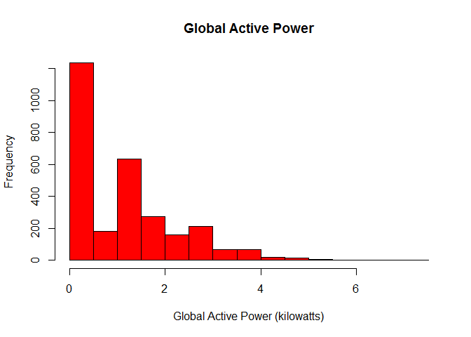
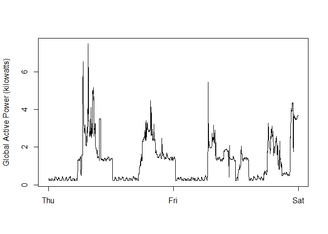
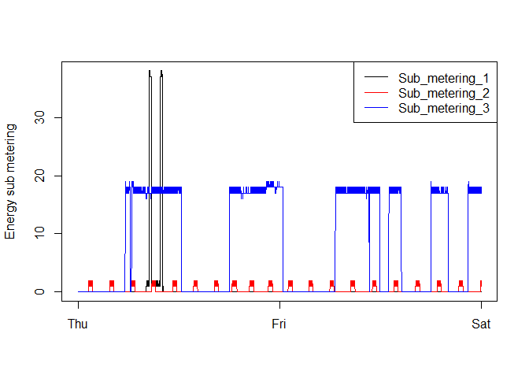

# Exploratory Data Analysis
Jeferson Bisconde  
Sunday, June 8, 2014  

### Household Electric Power Consumption

This assignment uses data from the [UC Irvine Machine Learning Repository](http://archive.ics.uci.edu/ml/), a popular repository for machine learning datasets. 

In particular, we will be using the **"Individual Household Electric Power Consumption"**:

        DESCRIPTION: 
        Measurements of electric power consumption in one household with a one-minute sampling rate over 
        a period of almost 4 years. Different electrical quantities and some sub-metering values are available.
**---------------------------------------------------------------------------------------------------------------------------**

**VARIABLES:**

<https://archive.ics.uci.edu/ml/datasets/Individual+household+electric+power+consumption>

* **Date**: Date in format *dd/mm/yyyy*

* **Time**: time in format *hh:mm:ss*

* **Global_active_power**: household global minute-averaged active power *(in kilowatt)*

* **Global_reactive_power**: household global minute-averaged reactive power *(in kilowatt)*

* **Voltage**: minute-averaged voltage *(in volt)*

* **Global_intensity**: household global minute-averaged current intensity *(in ampere)*

* **Sub_metering_1**: energy sub-metering No. 1 *(in watt-hour of active energy)*
        
        It corresponds to the kitchen, containing mainly a dishwasher, an oven and a microwave.

* **Sub_metering_2**: energy sub-metering No. 2 *(in watt-hour of active energy)*

        It corresponds to the laundry room, containing a washing-machine, a tumble-drier, a refrigerator and a light.

* **Sub_metering_3**: energy sub-metering No. 3 *(in watt-hour of active energy)*

        It corresponds to an electric water-heater and an air-conditioner.

**---------------------------------------------------------------------------------------------------------------------------**

The dataset has `2M+ rows` and `9 columns`. We will only be using data from `2007-02-01` and `2007-02-02`.

**GOAL:**

Our overall goal here is simply to examine how household energy usage varies over a 2-day period in February, 2007. My task is to plot several observations, all of which were constructed using the `base plotting system`.


```r
# Read the txt file
file <- read.table("household_power_consumption.txt", sep=";", stringsAsFactors=FALSE, header=TRUE)
file$Date <- as.Date(as.character(file$Date), "%d/%m/%Y")

# Create the subset consumption data to work with
twoDayConsumption <- subset(file, Date=="2007-02-01" | Date=="2007-02-02")

twoDayConsumption$Global_active_power <- as.numeric(twoDayConsumption$Global_active_power)

twoDayConsumption$Sub_metering_1 <- as.numeric(twoDayConsumption$Sub_metering_1)
twoDayConsumption$Sub_metering_2 <- as.numeric(twoDayConsumption$Sub_metering_2)
twoDayConsumption$Sub_metering_3 <- as.numeric(twoDayConsumption$Sub_metering_3)

twoDayConsumption$consumptionByHour <- with(twoDayConsumption, as.POSIXct(paste(as.character(Date), Time), 
                                            format="%Y-%m-%d %H:%M:%S", by="hour", length.out=24*2))
```


```r
# Function to create the 1st plot
consumptionPlot1 = function(dataset){
        hist(dataset$Global_active_power, col="red", 
             main="Global Active Power", xlab="Global Active Power (kilowatts)")
}
# First plot
consumptionPlot1(twoDayConsumption)
```

 


```r
# Function to create the 2nd plot
consumptionPlot2 = function(dataset){
        plot(dataset$consumptionByHour, dataset$Global_active_power, 
             type="l", ylab="Global Active Power (kilowatts)", xlab="")
}
# Second Plot
consumptionPlot2(twoDayConsumption)
```

 


```r
# Function to create the 3rd plot
consumptionPlot3 = function(dataset){
        # Create the plot without the points
        with(dataset, plot(consumptionByHour, Sub_metering_1, 
                           type="n", ylab="Energy sub metering", xlab=""))
        # Data points from all 3 sub metering
        with(dataset, points(consumptionByHour, Sub_metering_1, 
                             col="black", type="l"))
        with(dataset, points(consumptionByHour, Sub_metering_2, 
                             col="red", type="l"))
        with(dataset, points(consumptionByHour, Sub_metering_3, 
                             col="blue", type="l"))
        # Legend for the plot above
        legend("topright", legend=c("Sub_metering_1", "Sub_metering_2", "Sub_metering_3"), 
               lty=1, lwd=1, col=c("black","red","blue"))
}
# Third Plot
consumptionPlot3(twoDayConsumption)
```

 


```r
# Function to create the 4th plot
consumptionPlot4 = function(dataset, type){
        if (type==1){
                y=dataset$Voltage
                ylabel="Voltage"
        }
        else if (type==2){
                y=dataset$Global_reactive_power
                ylabel="Global Reactive Power"
        }
        with(dataset, plot(consumptionByHour, y, 
                           xlab="datetime", ylab=ylabel, type="l"))
}
```

We can also combine graphs as shown below:


```r
par(mfrow=c(2,2))
#First subplot
consumptionPlot2(twoDayConsumption)
#Second subplot
consumptionPlot4(twoDayConsumption, type=1)
#Third subplot
consumptionPlot3(twoDayConsumption)
#Fourth subplot
consumptionPlot4(twoDayConsumption, type=2)
```

 
