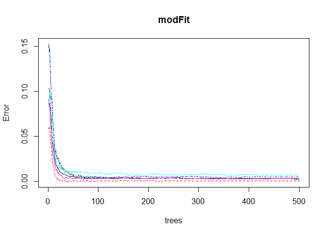

# Practical Machine Learning
Jeferson Bisconde  
Sunday, August 24, 2014  
**---------------------------------------------------------------------------------------------------------------------------------------------**

### Human Activity Recognition

Human Activity Recognition (HAR) has emerged as a key research area in the last years and is gaining increasing attention by the pervasive computing research community. This human activity recognition research has traditionally focused on discriminating between different activities,  
i.e., **to predict "which" activity** was performed at a specific point in time.

Read more: http://groupware.les.inf.puc-rio.br/har#ixzz3E1Ed4WzE

**Background**: The goal of this project is to predict the manner in which they did the exercise. This is the **"classe"** variable in the training set.

The data for this project came from this source: [Human Activity Recognition](http://groupware.les.inf.puc-rio.br/har).

===

Using the necessary libraries to do the work:

```r
library(ggplot2); library(caret); library(randomForest)
```

```
## Loading required package: lattice
## randomForest 4.6-10
## Type rfNews() to see new features/changes/bug fixes.
```

You can try different summarization techniques to figure out which columns to exclude.

Afterwards, remove the columns that are not important for prediction:

```r
har <- read.csv(file="pml-training.csv", header=TRUE)
harTest <- read.csv(file="pml-testing.csv", header=TRUE)
har <- har[,-nearZeroVar(har)]
har <- subset(har, select=(colMeans(is.na(har)) > 0.95) == 0)
har <- subset(har, select=-c(X, raw_timestamp_part_1,raw_timestamp_part_2,cvtd_timestamp))
```

Note that the `harTest` is the dataset that we want to predict, and `har` is the dataset we want to train and cross-validate our model.

I will separate the `har` data for both training and testing (**1 time cross-validation**).  

Even though **random forest** has a built-in cross-validation, I still think it's a good idea to verify it with a new dataset (testing dataset).


```r
inTrain <- createDataPartition(y=har$classe, p=0.6, list=FALSE)
training <- har[inTrain,]
testing <- har[-inTrain,]
```

We will now create our model based on the training dataset.

```r
fitControl <- trainControl(number=5, allowParallel=TRUE)
modFit <- randomForest(classe ~., data=training, trControl=fitControl)
```

Now, we will evaluate our model to the testing dataset to see how accurate our model is.

```r
pred <- predict(modFit, newdata=testing)
confusionMatrix(testing$classe, pred)
```

```
## Confusion Matrix and Statistics
## 
##           Reference
## Prediction    A    B    C    D    E
##          A 2232    0    0    0    0
##          B    3 1514    1    0    0
##          C    0    2 1366    0    0
##          D    0    0   12 1274    0
##          E    0    0    0    2 1440
## 
## Overall Statistics
##                                         
##                Accuracy : 0.997         
##                  95% CI : (0.996, 0.998)
##     No Information Rate : 0.285         
##     P-Value [Acc > NIR] : <2e-16        
##                                         
##                   Kappa : 0.997         
##  Mcnemar's Test P-Value : NA            
## 
## Statistics by Class:
## 
##                      Class: A Class: B Class: C Class: D Class: E
## Sensitivity             0.999    0.999    0.991    0.998    1.000
## Specificity             1.000    0.999    1.000    0.998    1.000
## Pos Pred Value          1.000    0.997    0.999    0.991    0.999
## Neg Pred Value          0.999    1.000    0.998    1.000    1.000
## Prevalence              0.285    0.193    0.176    0.163    0.184
## Detection Rate          0.284    0.193    0.174    0.162    0.184
## Detection Prevalence    0.284    0.193    0.174    0.164    0.184
## Balanced Accuracy       0.999    0.999    0.995    0.998    1.000
```

Success! As you can see, the Accuracy is really high! The out of sample error is only **0.003** after cross-validation.

```r
plot(modFit)
```

 

We are now ready to submit our answer using harTest! :)
