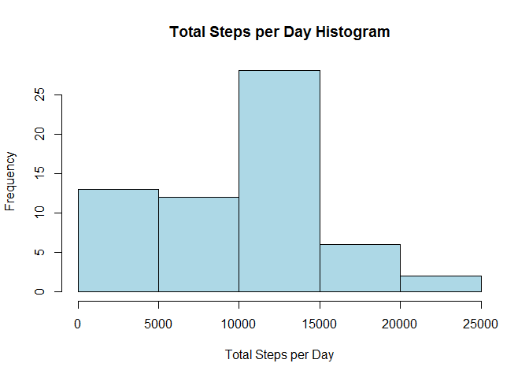
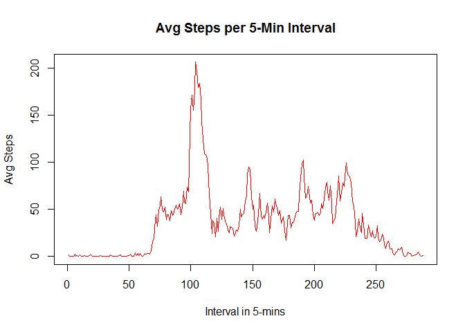
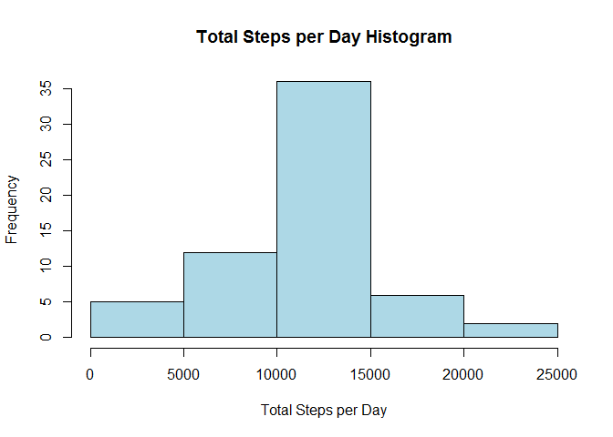
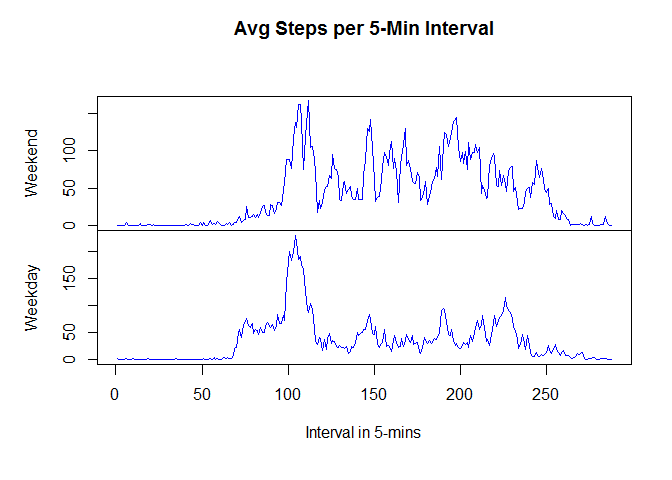

# Patterns in Personal Activity
Jeferson Bisconde  
Friday, September 05, 2014  

**---------------------------------------------------------------------------------------------------------------------------------------------**

### Introduction

This assignment makes use of data from a **personal activity monitoring device**.

        The data consists was collected from Oct and Nov 2012, and includes the number of steps taken in 5 min intervals each day.

The data can be downloaded from [Activity Monitoring Data](https://d396qusza40orc.cloudfront.net/repdata%2Fdata%2Factivity.zip).

VARIABLES:

* **steps**: Number of steps taking in a 5-minute interval (missing values are coded as NA)

* **date**: The date on which the measurement was taken in YYYY-MM-DD format

* **interval**: Identifier for the 5-minute interval in which measurement was taken

The dataset is stored in a comma-separated-value **(CSV)** file and there are a total of **17,568 observations** in this dataset.

**---------------------------------------------------------------------------------------------------------------------------------------------**

### Loading and Preprocessing


```r
library(data.table)
activity <- fread("activity.csv")
# Conver the date string column to dates
activity$date <- as.Date(activity$date)
# Converting interval to factor for the time-series
activity$interval <- factor(activity$interval)
```

**---------------------------------------------------------------------------------------------------------------------------------------------**

### What is mean total number of steps taken per day?

Plot of the **Histogram**

```r
# Sum the Steps
stepsHist = function(dataset) {
        totalSteps <- with(dataset, tapply(steps, date, sum, na.rm=TRUE))
        totalSteps <- data.frame(day=names(totalSteps), total=totalSteps)
        # Using the barplot
        hist(totalSteps$total,
                        xlab="Total Steps per Day", 
                        main=c("Total Steps per Day Histogram"), col="lightblue")
        
        stepsMean <- mean(totalSteps$total)
        stepsMedian <- median(totalSteps$total)      
        
        # Return the mean and median
        return(list(mean=stepsMean, median=stepsMedian))
}
# Create the Histogram, and store the mean and median
calc <- stepsHist(activity)
```

 

The **mean** and **median** Total Number of Steps per Day

```r
# Mean total number of steps taken per day
calc$mean
```

```
## [1] 9354
```

```r
# Median total number of steps taken per day
calc$median
```

```
## [1] 10395
```

**---------------------------------------------------------------------------------------------------------------------------------------------**

### What is the average daily activity pattern?

The plot of the **5-min Interval Time Series**

```r
avgSteps <- with(activity, tapply(steps, interval, mean, na.rm=TRUE))
avgSteps <- data.table(interval=names(avgSteps), mean=avgSteps)
# Creating a time-series
avgStepsTS <- ts(avgSteps$mean,
                 start=1, end=288)
# plotting the time-series
plot(avgStepsTS, 
     col="red", main="Avg Steps per 5-Min Interval",
     xlab="Interval in 5-mins", ylab="Avg Steps")
```

 

The interval with the **Highest** Avg Number of Steps

```r
# Finding which interval has the highest avg number of steps
index <- which(avgStepsTS==max(avgStepsTS))
avgSteps[index, interval]
```

```
## [1] "835"
```

**---------------------------------------------------------------------------------------------------------------------------------------------**

### Imputing missing values

Total Number of **Missing Values**

```r
# Calculating the total number of missing values
sum(is.na(activity$steps))
```

```
## [1] 2304
```

Filling all Missing Values with **Mean** of that 5-minute interval

```r
# Create a new dataset
activity2 <- data.frame(activity) # Only as data.frame just to make sure
```


```r
# Fill in the missing values
for (int in avgSteps$interval) {
        activity2[is.na(activity2$steps) & activity2$interval==int, ]$steps <- avgSteps[interval==int, ]$mean
}
```

Create a new Histogram based on the new dataset

```r
# Histogram using the previous function
calc2 <- stepsHist(activity2)
```

 

```r
# The Mean of the new dataset
calc2$mean
```

```
## [1] 10766
```

```r
# The Median of the new dataset
calc2$median
```

```
## [1] 10766
```

**---------------------------------------------------------------------------------------------------------------------------------------------**

### Are there differences in activity patterns between weekdays and weekends?

Create a new factor variable with two levels - **weekday** and **weekend**

```r
activity2$week[weekdays(activity$date)=="Saturday" | weekdays(activity$date)=="Sunday"] <- "weekend"
activity2$week[weekdays(activity$date)!="Saturday" & weekdays(activity$date)!="Sunday"] <- "weekday"
activity2$week <- factor(activity2$week)
```

The plot of the **5-min Interval Time Series** for both **weekend** and **weekday**

```r
weekendAvgSteps <- with(activity2[activity2$week=="weekend", ], tapply(steps, interval, mean, na.rm=TRUE))
weekdayAvgSteps <- with(activity2[activity2$week=="weekday", ], tapply(steps, interval, mean, na.rm=TRUE))
newAvgSteps <- data.table(Interval=names(weekendAvgSteps), Weekend=weekendAvgSteps, Weekday=weekdayAvgSteps)
# Creating a time-series
avgStepsTS2 <- ts(subset(newAvgSteps, select=-1),
                 start=1, end=288)
# plotting the time-series
plot(avgStepsTS2, 
     col="blue", main="Avg Steps per 5-Min Interval",
     xlab="Interval in 5-mins", ylab="Avg Steps")
```

 

